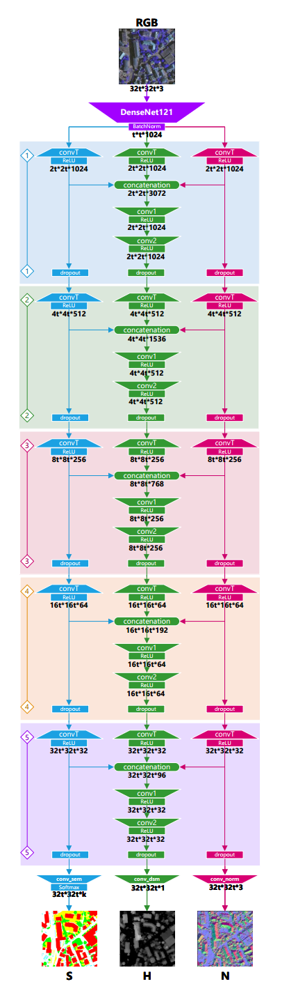
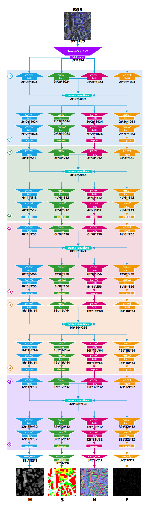

## DSMNet altered

### About

This repo provides you with a revised version of [DSMNet](https://ieeexplore.ieee.org/document/9585603) which introduces a two-stage method for height prediction from RGB UAV (Unmanned Aerial Vehicle) images. The predicted heightmap is also called digital surface model or DSM in brief.

In the first stage of DSMNet, a multi-task neural network predicts the height map based on a single RGB aerial input image, incorporating semantic and geometric information from additional branches. The second stage involves a denoising autoencoder that refines the initial height predictions, resulting in a more accurate height map. The proposed approach is performing appealingly well compared to some state-of-the-art (SOTA) methods. Training and testing is also conducted on two publicly available datasets: The ISPRS Vaihingen and the IEEE DFC2018.

The following diagram shows the overall pipeline of DSMNet with two stages, viz multi-task learning (MTL) network, and the denoising autoencoder (DAE) afterwards which receives as input the concatenation of the input RGB image alongside the three MTL predictions.

The following image shows three examples of RGB images as input with their respective MTL outputs, namely semantic segmentation, surface normals, and the heightmap.

Furthermore, in the following image you may understand better how DSMNet is performing on predicting heightmaps after each of the two stages compared to the ground truth. It is clear that the refined/denoised output is sharper and appealingly closer to the expected outcome.

  

You may find more details about this method on their [GitHub page](https://github.com/melhousni/DSMNet) and the [original manuscript](https://ieeexplore.ieee.org/document/9585603) itself.

### Our contribution

Our contribution here is twofold, one pertaining to exercising an additional geometrical feature out of DSM imagery to further help MTL learn better, and the other one is altering the decoder section of MTL in a more complex way, then the output will be expected to be a more precise one.

#### 1) Additional feature extraction

For the sake of this short study, we thought that probably exerting some computer vision techniques for extracting additional attributes out of the remote sensing imagery will be fruitful to our specific case which is concerned about building height estimation. However, DSMNet and some other similar models are estimating pixelwise height intensities of all objects present in the scene in which the buildings are only one category, hence they are generic height estimation techniques out of remote sensing imagery. As a result, we are still unfortunately short to some extent on attaining some feature maps isolated to solely the buildings.

However, we conducted some experiments to extract the edgemap out of every available annotation for DSMs and add that as an additive head for the MTL network. Therefore, apart from the head for height prediction, there will be three extra heads in MTL for predicting semantic labels, surface normals, and edgemaps. After the training of MTL is done, like before, its outputs will be concatenated alongside the input RGB image and fed to the denoising autoencoder for noise removal. Furthermore, due to the similarity of the output shapes and structures between heightmap and edgemap, their respective loss functions and error scaling factors are set the same.

#### Edgemap Generation

For the purpose of generating edgemaps from each nDSM, we decided to harness the power of the Canny edge detection algorithm, a famous and widely used computer vision technique. These edgemaps can be valuable features for models to differentiate buildings from other objects in the scene, potentially improving building height estimation accuracy.

#### i) Canny Edge Detection Steps

The Canny edge detection algorithm is a multi-stage approach for identifying strong edges in images with the following steps in brief:

1. **Grayscale Conversion**:  
   Convert the input image from color to grayscale. This simplifies the edge detection process by reducing the image data to a single intensity channel.

2. **Gaussian Blurring**:  
   Apply a Gaussian filter to smooth the image and reduce noise. This step helps in minimizing the impact of small fluctuations in intensity which can lead to false edge detection. The Gaussian kernel size and standard deviation need to be chosen carefully to balance noise reduction and edge preservation.

3. **Gradient Calculation**:  
   Compute the intensity gradients of the image using operators like Sobel or Prewitt to approximate the derivatives. This results in two gradient images, one for the horizontal direction ($G_x$) and one for the vertical direction ($G_y$).

   Calculate the edge strength (gradient magnitude) using the formula:

$$
G = \sqrt{Gx^2 + Gy^2}
$$

Calculate the edge direction (gradient angle) using the formula:

$$
\theta = \tan^{-1}\left(\frac{Gy}{Gx}\right)
$$

4. **Non-Maximum Suppression**:  
   Thin the edges by preserving only the local maxima in the gradient direction. For each pixel, check if it is a local maximum in its neighborhood in the direction of the gradient. If it is not, suppress it (set it to zero). This step refines the edges to be as thin as possible.

5. **Double Thresholding**:  
   Apply two thresholds (high and low) to classify pixels.
   - **Strong edges**: Pixels with gradient magnitude above the high threshold.
   - **Weak edges**: Pixels with gradient magnitude between the high and low thresholds.
   - **Non-edges**: Pixels with gradient magnitude below the low threshold.

   The high threshold identifies the most prominent edges, while the low threshold helps in connecting edge segments.

6. **Edge Tracking by Hysteresis**:  
   Finalize edge detection by linking edges. Starting from the strong edges, trace the edge chains by connecting weak edges that are 8-connected (connected in any direction) to strong edges. This step ensures that weak edges that are part of continuous edges are preserved, while isolated weak edges are discarded.

These detailed steps collectively enhance the accuracy and robustness of edge detection, producing a binary image where the detected edges are marked.

#### ii) Edgemap Generation Using Canny Algorithm

1. **Thresholding**:  
   The nDSM image undergoes thresholding to isolate pixels likely representing the building rooftops based on a predefined threshold. This results in a binary image where pixels exceeding the threshold are considered potential rooftop areas.

2. **Smoothing**:  
   A Gaussian filter is applied to the binary image to reduce noise and potentially improve edge detection.

3. **Morphological Operations**:  
   Morphological opening with a small kernel is employed to remove small isolated regions and further refine the image.

4. **Canny Edge Detection**:  
   Finally, the Canny edge detection algorithm is used on the processed binary image. This algorithm involves noise reduction, gradient calculation, non-maximum suppression, and double thresholding to identify and refine edges within the image. The output is an edgemap highlighting potential building outlines and other significant edges present in the nDSM data.

  

The above figure demonstrates the detection of potential rooftop areas out of our proposed algorithm. *However, you may notice that due to the presence of some other objects like trees which are elevated like buildings, this technique falls short on isolating man-made constructions like houses out of digital surface models. Nevertheless, we proceed with this type of on-the-fly generated annotation to further enhance the prediction of pixelwise heightmaps.*

#### 2) Altering MTL architecture

In the original manuscript of DSMNet, you may find out that in the MTL stage, DenseNet121 is set as the preferred encoder which has shown itself better than some other SOTA convolution-based encoders like ResNet101. Apart from that, in the decoder section, the authors are inspired by another work for depth estimation in natural images, in which the heads/branches aside from the main head designated to height estimation are sharing their weights with this head. It is expected that by this action, the overall accuracy will increase as the flow of information among different tasks is enhanced. You may understand this fact better in the following diagram which manifests the default MTL structure of DSMNet in detail:

In the output of this diagram, you may learn that 'S' stands for semantic segmentation task with k channels standing for k classes, 'H' with only one channel as a grayscale image stands for the predicted heightmap/DSM, and finally 'N' with 3 channels represents the surface normals estimation out of this MTL architecture.

Moreover, you may contemplate another additive head for estimating edgemap like what is happening for surface normals, though with only one channel in the end. This would manifest our first contribution in this short study as mentioned earlier.

However, in this study we tried to step further ahead and try to modify the way that MTL decoder heads are intertwined. In the default manner, the interconnection just goes for the heightmap head, but here we decided to do it for all heads. Further elaborated, according to the following diagram, we are sharing weights among all head in a way that each individual task is receiving information from all other tasks.

One crystal clear fact about the new architecture is that it will require a longer training time as a result of being more complex and having a way larger number of parameters in the decoder section.

### Implementation details

You may find the implementation fairly documented as for every parameter in the `config.py` file, there is enough information embedded apart from the other helpful comments inside other operational files. However, just as a summary over the main configuration, you may find the following notes helpful:

 - When you choose the dataset, you should consider and modify some other parameters too accordingly. Further elaborated, for Vaihingen and DFC2018, as these come with large image tiles as input, you should consider the `cropSize` parameter equal to 320 pixels as the default size in the original manuscript. 
	 - Although you have the option to choose different sizes, it’s essential to prioritize the original dimensions of the tiles. For better generalization, it’s advisable to select moderate sizes—not too small and not too large. 
	- In other words, this manner of selecting random patches out of large tiles is resembling the data augmentation procedure usually happening in deep learning tasks.
	- However, for DFC2023, the input imagery and all other annotations are of size 512*512 pixels, hence the whole image will be getting fed to the model, and no random patch selection is getting carried out.

- Parameter `sar_mode` shall be set to `True` just in case of the DFC2023 dataset, although even for this dataset you may consider this option discretional.
	- Further elaborated, in case of this specific dataset, some additive information is available for the model's input, entitled synthetic aperture radar (SAR) imagery with only one channel which generally offers detailed information about the radar reflectivity of objects or scenes, including their height. It’s a valuable tool for mapping terrain, monitoring changes, and understanding surface features.
	- In terms of datasets with this additional information in hand, the input RGB imagery is fused with SAR imagery to be fed to the MTL model. However, as DenseNet121 which is serving as the encoder of MTL, cannot afford input tensors with more than 3 channels, and the combination of RGB and SAR will be a 4-channel tensor, thus we need an additional convolution layer prior to the MTL's encoder to manage the dimensionality reduction for us.
	- It should be insisted here that you should not set the `sar_mode` parameter as `True` for other datasets not containing any SAR imagery. If so, there would be an extra convolutional operation happening before MTL which will be redundant.

- Important notes about MTL and DAE training parameters are available inside the `config.py` file. However, just as a quick note, you may consider changing the `mtl_training_samples` and `dae_training_samples` parameters based on the datasets with large input tiles as input (like Vaihingen and DFC2018), or those with images like a patch as input (like DFC2023). In case of large tiles, as the crop selection is established on a random basis resembling the data augmentation process, you may arbitrary set these training parameters, even though for the patch-based datasets, you should have the exact count of training samples in hand in the first place.

- If you have a pretrained MTL model, you may save quite some time by setting the `mtl_bb_freeze` parameter to `True`, then it will be just the decoder section of MTL getting trained. However, prior to that, to load a pretrained model, you should set `mtl_preload` to `True`.

- You may also alternate between different loss functions for regression tasks like heightmap estimation. Mean squared error and Huber loss are two available options here. You may also arbitrarily establish the delta hyperparameter of Huber loss accordingly.

- For the edgemap generation, you may set the related parameters, namely `roof_height_threshold`, `canny_lt`, and `canny_ht` based on every specific dataset. You may find suitable values w.r.t. the training dataset.

- You may also set flags for the presence/absence of additive MTL heads, viz semantic, normals, and edge head, apart from the main head for height estimation.

- `head_mode` is an option which enables you to switch between the original architecture for MTL decoder section and our proposed one earlier. Further detailed, `head_mode=dsm` will be the original one and `head_mode=full` will deploy the fully intertwined heads for MTL.

- The `correction` parameter is for testing the trained model. If you have exercised the denoising autoencoder as well, then you may set this parameter as `True` to apply correction on the first heightmap guess out of MTL.

- Lastly, you may determine the label codes for the semantic segmentation task alongside the scaling factors for various loss functions in MTL. Such scaling factors, as also stipulated inside the original manuscript, will just shorten the training time and does not necessarily have an impact on the overall accuracy.

- The `nets.py` file contains the architecture of MTL and DAE models, and `utils.py` file also provides utility functions with enough documentation that you may find them informative.

Finally, after setting the required parameters inside the `config.py` file, to train the MTL and DAE models, you may just run the `train_mtl.py` and `train_dae.py` files respectively. To test the trained models, you may run the `test_dsm.py` file, considering the `correction` parameter accordingly as stipulated earlier.
